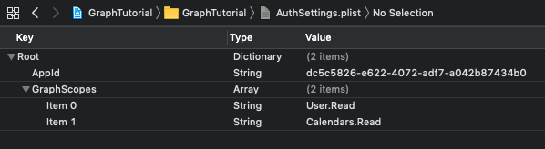
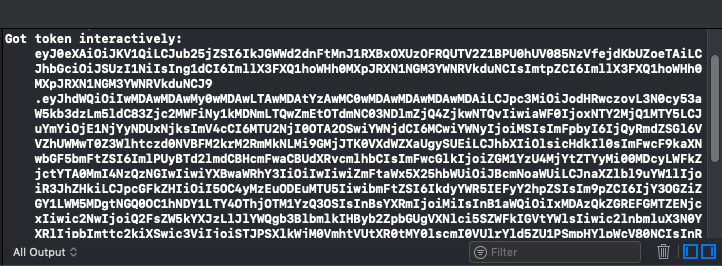

<!-- markdownlint-disable MD002 MD041 -->

In this exercise you will extend the application from the previous exercise to support authentication with Azure AD. This is required to obtain the necessary OAuth access token to call the Microsoft Graph. To do this, you will integrate the [Microsoft Authentication Library (MSAL) for iOS](https://github.com/AzureAD/microsoft-authentication-library-for-objc) into the application.

1. Create a new **Property List** file in the **GraphTutorial** project named **AuthSettings.plist**.
1. Add the following items to the file in the **Root** dictionary.

    | Key | Type | Value |
    |-----|------|-------|
    | `AppId` | String | The application ID from the Azure portal |
    | `GraphScopes` | Array | Two String values: `User.Read` and `Calendars.Read` |

    

> [!IMPORTANT]
> If you're using source control such as git, now would be a good time to exclude the **AuthSettings.plist** file from source control to avoid inadvertently leaking your app ID.

## Implement sign-in

In this section you will configure the project for MSAL, create an authentication manager class, and update the app to sign in and sign out.

### Configure project for MSAL

1. Add a new keychain group to your project's capabilities.
    1. Select the **GraphTutorial** project, then **Signing & Capabilities**.
    1. Select **+ Capability**, then double-click **Keychain Sharing**.
    1. Add a keychain group with the value `com.microsoft.adalcache`.

1. Control click **Info.plist** and select **Open As**, then **Source Code**.
1. Add the following inside the `<dict>` element.

    ```xml
    <key>CFBundleURLTypes</key>
    <array>
      <dict>
        <key>CFBundleURLSchemes</key>
        <array>
          <string>msauth.$(PRODUCT_BUNDLE_IDENTIFIER)</string>
        </array>
      </dict>
    </array>
    <key>LSApplicationQueriesSchemes</key>
    <array>
        <string>msauthv2</string>
        <string>msauthv3</string>
    </array>
    ```

1. Open **AppDelegate.swift** and add the following import statement at the top of the file.

    ```Swift
    import MSAL
    ```

1. Add the following function to the `AppDelegate` class.

    :::code language="swift" source="../demo/GraphTutorial/GraphTutorial/AppDelegate.swift" id="HandleMsalResponseSnippet":::

### Create authentication manager

1. Create a new **Swift File** in the **GraphTutorial** project named **AuthenticationManager.swift**. Add the following code to the file.

    :::code language="swift" source="../demo/GraphTutorial/GraphTutorial/AuthenticationManager.swift" id="AuthManagerSnippet":::

### Add sign-in and sign-out

1. Open **SignInViewController.swift** and replace its contents with the following code.

    :::code language="swift" source="../demo/GraphTutorial/GraphTutorial/SignInViewController.swift" id="SignInViewSnippet":::

1. Open **WelcomeViewController.swift** and replace the existing `signOut` function with the following.

    :::code language="swift" source="../demo/GraphTutorial/GraphTutorial/WelcomeViewController.swift" id="SignOutSnippet":::

1. Save your changes and restart the application in Simulator.

If you sign in to the app, you should see an access token displayed in the output window in Xcode.



## Get user details

In this section you will create a helper class to hold all of the calls to Microsoft Graph and update the `WelcomeViewController` to use this new class to get the logged-in user.

1. Create a new **Swift File** in the **GraphTutorial** project named **GraphManager.swift**. Add the following code to the file.

    ```Swift
    import Foundation
    import MSGraphClientSDK
    import MSGraphClientModels

    class GraphManager {

        // Implement singleton pattern
        static let instance = GraphManager()

        private let client: MSHTTPClient?

        private init() {
            client = MSClientFactory.createHTTPClient(with: AuthenticationManager.instance)
        }

        public func getMe(completion: @escaping(MSGraphUser?, Error?) -> Void) {
            // GET /me
            let meRequest = NSMutableURLRequest(url: URL(string: "\(MSGraphBaseURL)/me")!)
            let meDataTask = MSURLSessionDataTask(request: meRequest, client: self.client, completion: {
                (data: Data?, response: URLResponse?, graphError: Error?) in
                guard let meData = data, graphError == nil else {
                    completion(nil, graphError)
                    return
                }

                do {
                    // Deserialize response as a user
                    let user = try MSGraphUser(data: meData)
                    completion(user, nil)
                } catch {
                    completion(nil, error)
                }
            })

            // Execute the request
            meDataTask?.execute()
        }
    }
    ```

1. Open **WelcomeViewController.swift** and add the following `import` statement at the top of the file.

    ```Swift
    import MSGraphClientModels
    ```

1. Add the following property to the `WelcomeViewController` class.

    ```Swift
    private let spinner = SpinnerViewController()
    ```

1. Replace the existing `viewDidLoad` with the following code.

    :::code language="swift" source="../demo/GraphTutorial/GraphTutorial/WelcomeViewController.swift" id="ViewDidLoadSnippet":::

If you save your changes and restart the app now, after sign-in the UI is updated with the user's display name and email address.
