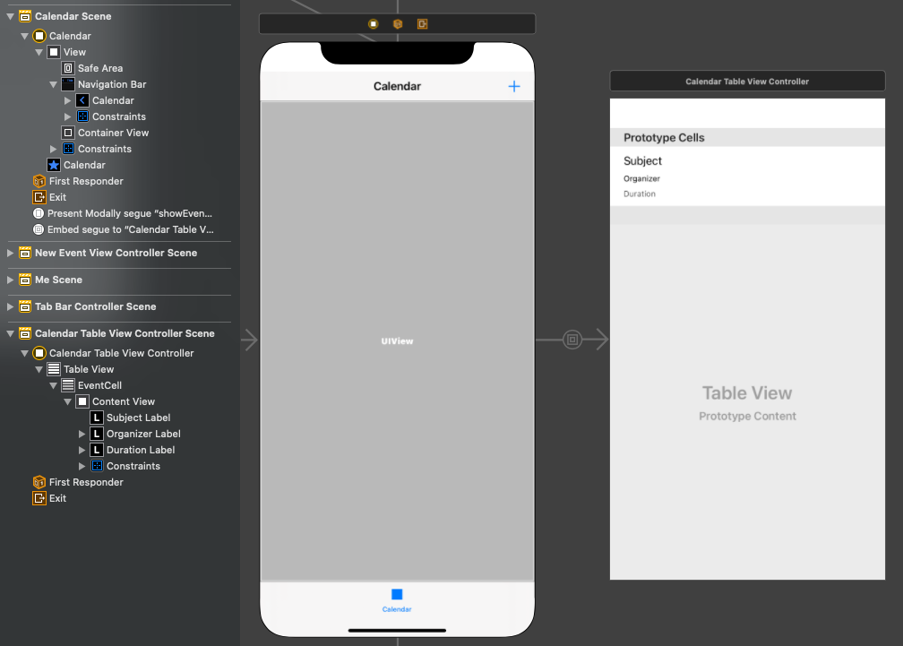

<!-- markdownlint-disable MD002 MD041 -->

In this exercise you will incorporate the Microsoft Graph into the application. For this application, you will use the [Microsoft Graph SDK for Objective C](https://github.com/microsoftgraph/msgraph-sdk-objc) to make calls to Microsoft Graph.

## Get calendar events from Outlook

In this section you will extend the `GraphManager` class to add a function to get the user's events for the current week and update `CalendarViewController` to use these new functions.

1. Open **GraphManager.swift** and add the following method to the `GraphManager` class.

    ```Swift
    public func getCalendarView(viewStart: String,
                                viewEnd: String,
                                completion: @escaping(Data?, Error?) -> Void) {
        // GET /me/calendarview
        // Set start and end of the view
        let start = "startDateTime=\(viewStart)"
        let end = "endDateTime=\(viewEnd)"
        // Only return these fields in results
        let select = "$select=subject,organizer,start,end"
        // Sort results by when they were created, newest first
        let orderBy = "$orderby=start/dateTime"
        // Request at most 25 results
        let top = "$top=25"

        let eventsRequest = NSMutableURLRequest(url: URL(string: "\(MSGraphBaseURL)/me/calendarview?\(start)&\(end)&\(select)&\(orderBy)&\(top)")!)

        // Add the Prefer: outlook.timezone header to get start and end times
        // in user's time zone
        eventsRequest.addValue("outlook.timezone=\"\(self.userTimeZone)\"", forHTTPHeaderField: "Prefer")

        let eventsDataTask = MSURLSessionDataTask(request: eventsRequest, client: self.client, completion: {
            (data: Data?, response: URLResponse?, graphError: Error?) in
            guard let eventsData = data, graphError == nil else {
                completion(nil, graphError)
                return
            }

            // TEMPORARY
            completion(eventsData, nil)
        })

        // Execute the request
        eventsDataTask?.execute()
    }
    ```

    > [!NOTE]
    > Consider what the code in `getCalendarView` is doing.
    >
    > - The URL that will be called is `/v1.0/me/calendarview`.
    >   - The `startDateTime` and `endDateTime` query parameters define the start and end of the calendar view.
    >   - The `select` query parameter limits the fields returned for each events to just those the view will actually use.
    >   - The `orderby` query parameter sorts the results by start time.
    >   - The `top` query parameter requests 25 results per page.
    >   - the `Prefer: outlook.timezone` header causes the Microsoft Graph to return the start and end times of each event in the user's time zone.

1. Create a new **Swift File** in the **GraphTutorial** project named **GraphToIana.swift**. Add the following code to the file.

    :::code language="swift" source="../demo/GraphTutorial/GraphTutorial/GraphToIana.swift" id="GraphToIanaSnippet":::

    This does a simple lookup to find an IANA time zone identifier based on the time zone name returned by Microsoft Graph.

1. Open **CalendarViewController.swift** and replace its entire contents with the following code.

    ```Swift
    import UIKit
    import MSGraphClientModels

    class CalendarViewController: UIViewController {

        @IBOutlet var calendarJSON: UITextView!

        private let spinner = SpinnerViewController()

        override func viewDidLoad() {
            super.viewDidLoad()

            // Do any additional setup after loading the view.
            self.spinner.start(container: self)

            // Calculate the start and end of the current week
            let timeZone = GraphToIana.getIanaIdentifier(graphIdentifer: GraphManager.instance.userTimeZone)
            let now = Date()
            var calendar = Calendar(identifier: .gregorian)
            calendar.timeZone = TimeZone(identifier: timeZone)!

            let startOfWeek = calendar.dateComponents([.calendar, .yearForWeekOfYear, .weekOfYear], from: now).date!
            let endOfWeek = calendar.date(byAdding: .day, value: 7, to: startOfWeek)!

            // Convert start and end to ISO 8601 strings
            let isoFormatter = ISO8601DateFormatter()
            let viewStart = isoFormatter.string(from: startOfWeek)
            let viewEnd = isoFormatter.string(from: endOfWeek)

            GraphManager.instance.getCalendarView(viewStart: viewStart, viewEnd: viewEnd) {
                (data: Data?, error: Error?) in
                DispatchQueue.main.async {
                    self.spinner.stop()

                    // TEMPORARY
                    guard let eventsData = data, error == nil else {
                        self.calendarJSON.text = error.debugDescription
                        return
                    }

                    let jsonString = String(data: eventsData, encoding: .utf8)
                    self.calendarJSON.text = jsonString
                    self.calendarJSON.sizeToFit()
                }
            }
        }
    }
    ```

You can now run the app, sign in, and tap the **Calendar** navigation item in the menu. You should see a JSON dump of the events in the app.

## Display the results

Now you can replace the JSON dump with something to display the results in a user-friendly manner. In this section, you will modify the `getCalendarView` function to return strongly-typed objects, and modify `CalendarViewController` to use a table view to render the events.

1. Open **GraphManager.swift**. Replace the existing `getCalendarView` function with the following.

    :::code language="swift" source="../demo/GraphTutorial/GraphTutorial/GraphManager.swift" id="GetEventsSnippet" highlight="1,26-47":::

1. Create a new **Cocoa Touch Class** file in the **GraphTutorial** project named `CalendarTableViewController.swift`. Choose **UITableViewController** in the **Subclass of** field.

1. Open **CalendarTableViewController.swift** and replace its contents with the following.

    :::code language="swift" source="../demo/GraphTutorial/GraphTutorial/CalendarTableViewController.swift" id="CalendarTableViewControllerSnippet":::

1. Create a new **Cocoa Touch Class** file in the **GraphTutorial** project named `CalendarTableViewCell.swift`. Choose **UITableViewCell** in the **Subclass of** field.

1. Open **CalendarTableViewCell.swift** and add the following properties to the `CalendarTableViewCell` class.

    :::code language="swift" source="../demo/GraphTutorial/GraphTutorial/CalendarTableViewCell.swift" id="PropertiesSnippet":::

1. Open **Main.storyboard** and locate the **Calendar Scene**. Delete the text view from the root view.
1. Using the **Library**, add a **Navigation Bar** to the top of the view.
1. Double-click the **Title** in the navigation bar and update it to `Calendar`.
1. Using the **Library**, add a **Bar Button Item** to the right-hand side of the navigation bar.
1. Select the new bar button, then select the **Attributes Inspector**. Change **Image** to **plus**.
1. Add a **Container View** from the **Library** to the view under the navigation bar. Resize the container view to take all of the remaining space in the view.
1. Set constraints on the navigation bar and container view as follows.

    - **Navigation Bar**
        - Add constraint: Height, value: 44
        - Add constraint: Leading space to Safe Area, value: 0
        - Add constraint: Trailing space to Safe Area, value: 0
        - Add constraint: Top space to Safe Area, value: 0
    - **Container View**
        - Add constraint: Leading space to Safe Area, value: 0
        - Add constraint: Trailing space to Safe Area, value: 0
        - Add constraint: Top space to Navigation Bar Bottom, value: 0
        - Add constraint: Bottom space to Safe Area, value: 0

1. Locate the second view controller added to the storyboard when you added the container view. It is connected to the **Calendar Scene** by an embed segue. Select this controller and use the **Identity Inspector** to change **Class** to **CalendarTableViewController**.
1. Delete the **View** from the **Calendar Table View Controller**.
1. Add a **Table View** from the **Library** to the **Calendar Table View Controller**.
1. Select the table view, then select the **Attributes Inspector**. Set **Prototype Cells** to **1**.
1. Drag the bottom edge of the prototype cell to give you a larger area to work with.
1. Use the **Library** to add three **Labels** to the prototype cell.
1. Select the prototype cell, then select the **Identity Inspector**. Change **Class** to **CalendarTableViewCell**.
1. Select the **Attributes Inspector** and set **Identifier** to `EventCell`.
1. With the **EventCell** selected, select the **Connections Inspector** and connect `durationLabel`, `organizerLabel`, and `subjectLabel` to the labels you added to the cell on the storyboard.
1. Set the properties and constraints on the three labels as follows.

    - **Subject Label**
        - Add constraint: Leading space to Content View Leading Margin, value: 0
        - Add constraint: Trailing space to Content View Trailing Margin, value: 0
        - Add constraint: Top space to Content View Top Margin, value: 0
    - **Organizer Label**
        - Font: System 12.0
        - Add constraint: Height, value: 15
        - Add constraint: Leading space to Content View Leading Margin, value: 0
        - Add constraint: Trailing space to Content View Trailing Margin, value: 0
        - Add constraint: Top space to Subject Label Bottom, value: Standard
    - **Duration Label**
        - Font: System 12.0
        - Color: Dark Gray Color
        - Add constraint: Height, value: 15
        - Add constraint: Leading space to Content View Leading Margin, value: 0
        - Add constraint: Trailing space to Content View Trailing Margin, value: 0
        - Add constraint: Top space to Organizer Label Bottom, value: Standard
        - Add constraint: Bottom space to Content View Bottom Margin, value: 0

1. Select the **Calendar Table View Cell**, then select the **Size Inspector**. Enable **Automatic** for **Row Height**.

    

1. Open **CalendarViewController.swift** and replace its contents with the following code.

    :::code language="swift" source="../demo/GraphTutorial/GraphTutorial/CalendarViewController.swift" id="CalendarViewSnippet":::

1. Run the app, sign in, and tap the **Calendar** tab. You should see the list of events.

    
