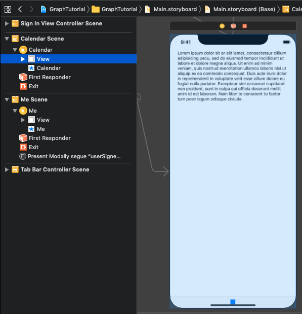
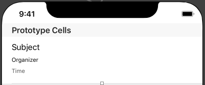
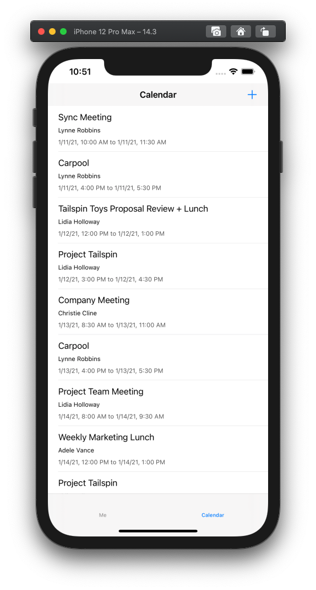

<!-- markdownlint-disable MD002 MD041 -->

In this exercise you will incorporate the Microsoft Graph into the application. For this application, you will use the [Microsoft Graph SDK for Objective C](https://github.com/microsoftgraph/msgraph-sdk-objc) to make calls to Microsoft Graph.

## Get calendar events from Outlook

In this section you will extend the `GraphManager` class to add a function to get the user's events and update `CalendarViewController` to use these new functions.

1. Open **GraphManager.swift** and add the following method to the `GraphManager` class.

    ```Swift
    public func getEvents(completion: @escaping(Data?, Error?) -> Void) {
        // GET /me/events?$select='subject,organizer,start,end'$orderby=createdDateTime DESC
        // Only return these fields in results
        let select = "$select=subject,organizer,start,end"
        // Sort results by when they were created, newest first
        let orderBy = "$orderby=createdDateTime+DESC"
        let eventsRequest = NSMutableURLRequest(url: URL(string: "\(MSGraphBaseURL)/me/events?\(select)&\(orderBy)")!)
        let eventsDataTask = MSURLSessionDataTask(request: eventsRequest, client: self.client, completion: {
            (data: Data?, response: URLResponse?, graphError: Error?) in
            guard let eventsData = data, graphError == nil else {
                completion(nil, graphError)
                return
            }

            // TEMPORARY
            completion(eventsData, nil)
        })

        // Execute the request
        eventsDataTask?.execute()
    }
    ```

    > [!NOTE]
    > Consider what the code in `getEvents` is doing.
    >
    > - The URL that will be called is `/v1.0/me/events`.
    > - The `select` query parameter limits the fields returned for each events to just those the app will actually use.
    > - The `orderby` query parameter sorts the results by the date and time they were created, with the most recent item being first.

1. Open **CalendarViewController.swift** and replace its entire contents with the following code.

    ```Swift
    import UIKit
    import MSGraphClientModels

    class CalendarViewController: UIViewController {

        @IBOutlet var calendarJSON: UITextView!

        private let spinner = SpinnerViewController()

        override func viewDidLoad() {
            super.viewDidLoad()

            // Do any additional setup after loading the view.
            self.spinner.start(container: self)

            GraphManager.instance.getEvents {
                (data: Data?, error: Error?) in
                DispatchQueue.main.async {
                    self.spinner.stop()

                    guard let eventsData = data, error == nil else {
                        self.calendarJSON.text = error.debugDescription
                        return
                    }

                    let jsonString = String(data: eventsData, encoding: .utf8)
                    self.calendarJSON.text = jsonString
                    self.calendarJSON.sizeToFit()
                }
            }
        }
    }
    ```

You can now run the app, sign in, and tap the **Calendar** navigation item in the menu. You should see a JSON dump of the events in the app.

## Display the results

Now you can replace the JSON dump with something to display the results in a user-friendly manner. In this section, you will modify the `getEvents` function to return strongly-typed objects, and modify `CalendarViewController` to use a table view to render the events.

1. Open **GraphManager.swift**. Replace the existing `getEvents` function with the following.

    :::code language="swift" source="../demo/GraphTutorial/GraphTutorial/GraphManager.swift" id="GetEventsSnippet" highlight="1,17-38":::

1. Create a new **Cocoa Touch Class** file in the **GraphTutorial** project named `CalendarTableViewCell.swift`. Choose **UITableViewCell** in the **Subclass of** field.

1. Open **CalendarTableViewCell.swift** and add the following code to the `CalendarTableViewCell` class.

    :::code language="swift" source="../demo/GraphTutorial/GraphTutorial/CalendarTableViewCell.swift" id="PropertiesSnippet":::

1. Open **Main.storyboard** and locate the **Calendar Scene**. Select the **View** in the **Calendar Scene** and delete it.

    

1. Add a **Table View** from the **Library** to the **Calendar Scene**.
1. Select the table view, then select the **Attributes Inspector**. Set **Prototype Cells** to **1**.
1. Use the **Library** to add three **Labels** to the prototype cell.
1. Select the prototype cell, then select the **Identity Inspector**. Change **Class** to **CalendarTableViewCell**.
1. Select the **Attributes Inspector** and set **Identifier** to `EventCell`.
1. With the **EventCell** selected, select the **Connections Inspector** and connect `durationLabel`, `organizerLabel`, and `subjectLabel` to the labels you added to the cell on the storyboard.
1. Set the properties and constraints on the three labels as follows.

    - **Subject Label**
        - Add constraint: Leading space to Content View Leading Margin, value: 0
        - Add constraint: Trailing space to Content View Trailing Margin, value: 0
        - Add constraint: Top space to Content View Top Margin, value: 0
    - **Organizer Label**
        - Font: System 12.0
        - Add constraint: Leading space to Content View Leading Margin, value: 0
        - Add constraint: Trailing space to Content View Trailing Margin, value: 0
        - Add constraint: Top space to Subject Label Bottom, value: Standard
    - **Duration Label**
        - Font: System 12.0
        - Color: Dark Gray Color
        - Add constraint: Leading space to Content View Leading Margin, value: 0
        - Add constraint: Trailing space to Content View Trailing Margin, value: 0
        - Add constraint: Top space to Organizer Label Bottom, value: Standard
        - Add constraint: Bottom space to Content View Bottom Margin, value: 8

    

1. Open **CalendarViewController.swift** and replace its contents with the following code.

    :::code language="swift" source="../demo/GraphTutorial/GraphTutorial/CalendarViewController.swift" id="CalendarViewSnippet":::

1. Run the app, sign in, and tap the **Calendar** tab. You should see the list of events.

    
