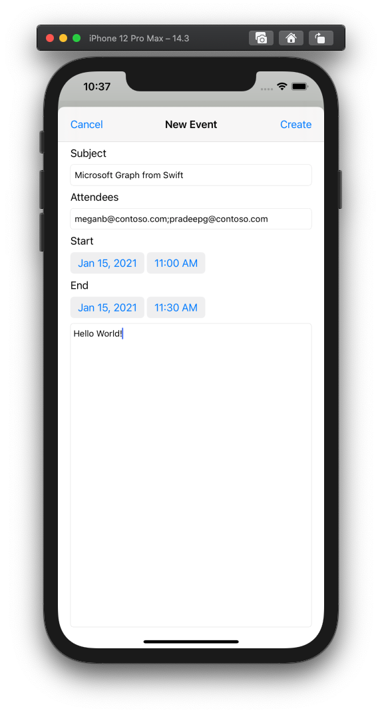

<!-- markdownlint-disable MD002 MD041 -->

In this section you will add the ability to create events on the user's calendar.

1. Open **GraphManager.swift** and add the following function to create a new event on the user's calendar.

    :::code language="swift" source="../demo/GraphTutorial/GraphTutorial/GraphManager.swift" id="CreateEventSnippet":::

1. Create a new **Cocoa Touch Class** file in the **GraphTutorial** folder named `NewEventViewController`. Choose **UIViewController** in the **Subclass of** field.
1. Open **NewEventViewController.swift** and replace its contents with the following.

    :::code language="swift" source="../demo/GraphTutorial/GraphTutorial/NewEventViewController.swift" id="NewEventViewControllerSnippet":::

1. Open **Main.storyboard**. Use the **Library** to drag a **View Controller** onto the storyboard.
1. Using the **Library**, add a **Navigation Bar** to the view controller.
1. Double-click the **Title** in the navigation bar and update it to `New Event`.
1. Using the **Library**, add a **Bar Button Item** to the left-hand side of the navigation bar.
1. Select the new bar button, then select the **Attributes Inspector**. Change **Title** to `Cancel`.
1. Using the **Library**, add a **Bar Button Item** to the right-hand side of the navigation bar.
1. Select the new bar button, then select the **Attributes Inspector**. Change **Title** to `Create`.
1. Select the view controller, then select the **Identity Inspector**. Change **Class** to **NewEventViewController**.
1. Add the following controls from the **Library** to the view.

    - Add a **Label** under the navigation bar. Set its text to `Subject`.
    - Add a **Text Field** under the label. Set its **Placeholder** attribute to `Subject`.
    - Add a **Label** under the text field. Set its text to `Attendees`.
    - Add a **Text Field** under the label. Set its **Placeholder** attribute to `Separate multiple entries with ;`.
    - Add a **Label** under the text field. Set its text to `Start`.
    - Add a **Date Picker** under the label. Set its **Preferred Style** to **Compact**, its **Interval** to **15 minutes**, and its height to **35**.
    - Add a **Label** under the date picker. Set its text to `End`.
    - Add a **Date Picker** under the label. Set its **Preferred Style** to **Compact**, its **Interval** to **15 minutes**, and its height to **35**.
    - Add a **Text View** under the date picker.

1. Select the **New Event View Controller** and use the **Connection Inspector** to make the following connections.

    - Connect the **cancel** received action to the **Cancel** bar button.
    - Connect the **createEvent** received action to the **Create** bar button.
    - Connect the **subject** outlet to the first text field.
    - Connect the **attendees** outlet to the second text field.
    - Connect the **start** outlet to the first date picker.
    - Connect the **end** outlet to the second date picker.
    - Connect the **body** outlet to the text view.

1. Add the following constraints.

    - **Navigation Bar**
        - Leading space to Safe Area, value: 0
        - Trailing space to Safe Area, value: 0
        - Top space to Safe Area, value: 0
        - Height, value: 44
    - **Subject Label**
        - Leading space to View margin, value: 0
        - Trailing space to View margin, value: 0
        - Top space to Navigation Bar, value: 20
    - **Subject Text Field**
        - Leading space to View margin, value: 0
        - Trailing space to View margin, value: 0
        - Top space to Subject Label, value: Standard
    - **Attendees Label**
        - Leading space to View margin, value: 0
        - Trailing space to View margin, value: 0
        - Top space to Subject Text Field, value: Standard
    - **Attendees Text Field**
        - Leading space to View margin, value: 0
        - Trailing space to View margin, value: 0
        - Top space to Attendees Label, value: Standard
    - **Start Label**
        - Leading space to View margin, value: 0
        - Trailing space to View margin, value: 0
        - Top space to Subject Text Field, value: Standard
    - **Start Date Picker**
        - Leading space to View margin, value: 0
        - Trailing space to View margin, value: 0
        - Top space to Attendees Label, value: Standard
        - Height, value: 35
    - **End Label**
        - Leading space to View margin, value: 0
        - Trailing space to View margin, value: 0
        - Top space to Start Date Picker, value: Standard
    - **End Date Picker**
        - Leading space to View margin, value: 0
        - Trailing space to View margin, value: 0
        - Top space to End Label, value: Standard
        - Height: 35
    - **Body Text View**
        - Leading space to View margin, value: 0
        - Trailing space to View margin, value: 0
        - Top space to End Date Picker, value: Standard
        - Bottom space to View margin, value: 0

1. Select the **Calendar Scene**, then select the **Connections Inspector**.
1. Under **Triggered Segues**, drag the unfilled circle next to **manual** onto the **New Event View Controller** on the storyboard. Select **Present Modally** in the pop-up menu.
1. Select the segue you just added, then select the **Attributes Inspector**. Set the **Identifier** field to `showEventForm`.
1. Connect the **showNewEventForm** received action to the **+** navigation bar button.
1. Save your changes and restart the app. Go to the calendar page and tap the **+** button. Fill in the form and tap **Create** to create a new event.

    
